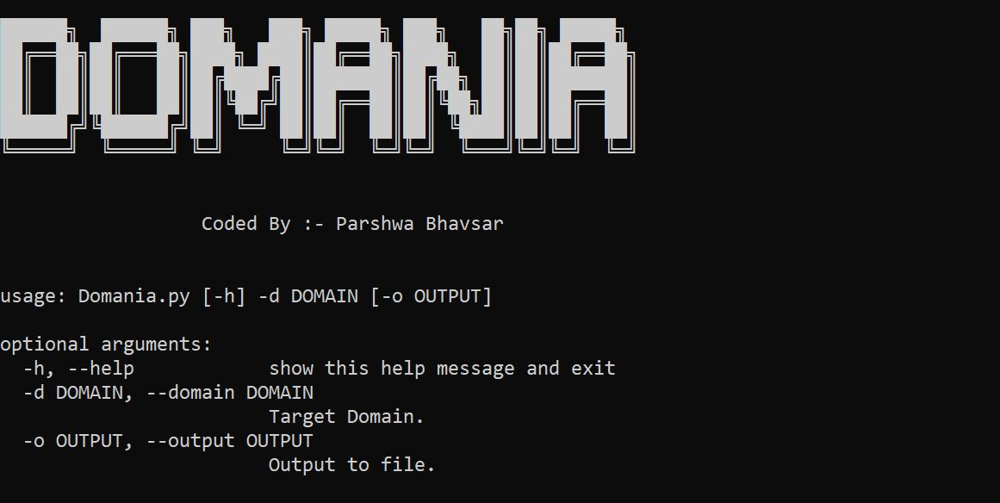

# Domania
Python based most advanced tool to enumerate subdomains with Alphabetical Order and Live subdomains.
You don't need to short by alphabetical order manually .
This tool can do it itself.

# Prerequisites
You have Python installed in your SYSTEM.


# Installation 

```
git clone https://github.com/Parshwa218/Domania.git
```
```
cd Domania
```

# Usage 

```
python Domania.py --help
python Domania.py -d <target> 
python Domania.py -d <target> -o target.txt
```

# Developed By
- Parshwa Bhavsar

# Developer's Notice
 - Feedbacks are welcomed.
 - Give suggestions for improvement.
 
# Contact Developer
- LinkedIn :- Parshwa Bhavsar 
